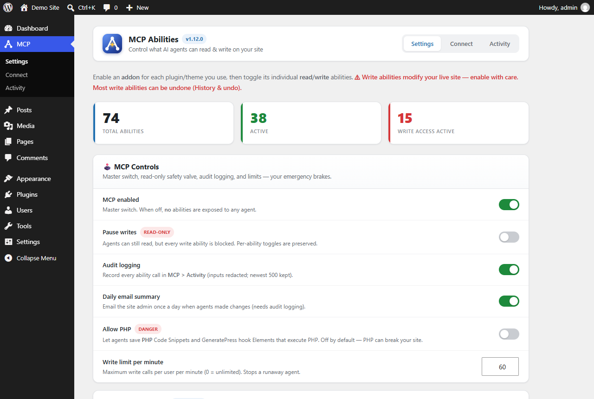
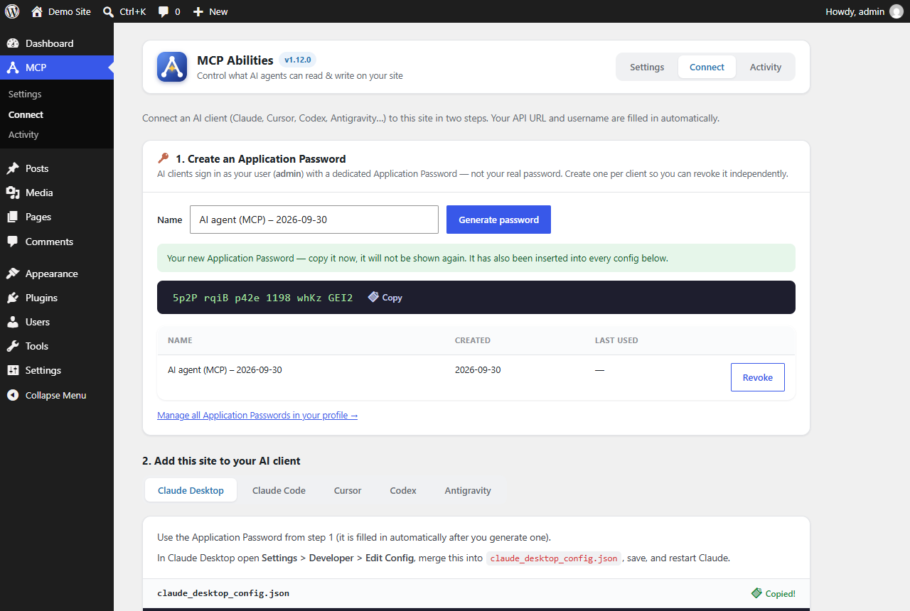
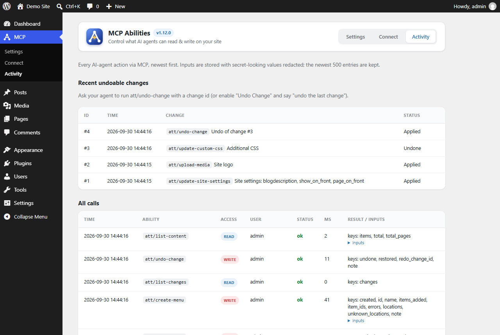

# ATT MCP Abilities

> **By ATT ([AnupTechTips](https://anuptechtips.com))**

[](https://github.com/the-anup-das/att-mcp-abilities/actions/workflows/ci.yml)


[](LICENSE)

Let AI agents (Claude, Cursor, Codex, Antigravity) read your WordPress site and, where you allow it, **build it, edit it, speed it up and optimise it for search**. It works through the WordPress Abilities API and the [MCP Adapter](https://github.com/WordPress/mcp-adapter). Every ability is an opt-in toggle, and every write can be paused, rate-limited and audited; most can also be undone.

---

## ✨ Highlights

- 🔑 **One-click connection.** Generate an Application Password on **MCP → Connect**. The plugin fills it into ready-made configs for Claude Desktop, Claude Code, Cursor, Codex and Antigravity, and never stores it.
- 🏗️ **Site-building tools.** Any content type with full block markup, templates, terms, featured images and meta; site settings (homepage, permalinks, identity); menus; media; block-theme templates and global styles; GeneratePress settings and Elements; Elementor layouts and kit; Code Snippets.
- 🚀 **Performance & caching.** An audit of what slows the site down (server, database, autoloaded options, cron, cache plugins and a real page load) with prioritised fixes, Google PageSpeed Insights, database clean-up, autoload control and thumbnail regeneration. LiteSpeed Cache and Super Page Cache settings (and LiteSpeed presets) are changed through each plugin's own API; credentials are never exposed.
- 📈 **SEO.** Post analysis on the rendered page (title, description, focus keyword, headings, images, links, readability) with fixes and internal-link suggestions, a bulk SEO audit, and SEO title/description/keyword/canonical/indexing writes for Yoast SEO, Rank Math, All in One SEO and SEOPress.
- 🧩 **Addon framework.** Abilities are grouped per integration, and detected plugins/themes light up automatically. Extend it with the `att_mcp_addons` and `att_mcp_abilities` filters.
- 🕹️ **Safety controls.** A master kill switch, read-only mode, a per-user write rate limit, a daily email summary, and an admin-only **Allow PHP** switch.
- ↩️ **Undo.** Options, theme mods, Additional CSS, site settings, menu locations, builder layouts, meta, SEO fields, cache-plugin settings and option autoloading are snapshotted before each change. Content, templates and global styles keep WordPress revisions.
- 🧾 **Audit log.** Every call is recorded (inputs redacted) in **MCP → Activity**.

| Settings | Connect | Activity |
|---|---|---|
|  |  |  |

---

## 🛠️ Ability groups (91 abilities)

| Addon | Groups | Notes |
|---|---|---|
| **Core** | Posts, Pages, any content type, Taxonomy, Comments, Media, Users, Search, Menus, Site, **Performance & caching**, **SEO**, History & undo | Always available |
| **Design** | Theme info, Additional CSS, theme mods, options, page rendering (drafts too), reference-site fetching, cache purge; **Site Editor**: templates, template parts, global styles | Works with any theme |
| **GeneratePress** | Settings (with dynamic CSS refresh); Elements (list/read/save/delete) | When GeneratePress is active |
| **Elementor** | Pages and elements (read, find, update, add, remove), whole-layout save, global kit | When Elementor is active |
| **Code Snippets** | Read/save/delete snippets (CSS/JS/HTML; PHP behind the admin switch) | When Code Snippets is active |
| **Advanced** | REST API passthrough (sensitive routes blocked); install/activate plugins and themes from WordPress.org | Opt-in, for fully trusted agents |

Every ability starts **OFF** except a few safe reads: published posts, pages, categories, tags, search and site info.

---

## 🚀 Quick start

**Prerequisites:** WordPress 6.9+ (the Abilities API is in core), the [MCP Adapter](https://github.com/WordPress/mcp-adapter) plugin, and Node.js 18+ on the computer running your AI client.

1. Install and activate **MCP Adapter** and this plugin.
2. In **MCP → Settings**, enable the addons and abilities you want.
3. In **MCP → Connect**, click **Generate password**, then copy the config for your AI client.
4. Paste it into your client (e.g. `claude_desktop_config.json`, or run the Claude Code command) and restart the client.
5. Start prompting, and watch **MCP → Activity**.

For least privilege, create a dedicated Editor user for AI agents and generate its Application Password while logged in as that user.

---

## 🔒 Security model

- The connection uses a WordPress **Application Password** (handled by MCP Adapter), so it can do at most what that WordPress user can do.
- Every write checks the capability for the **specific** post, term, comment or file (`edit_post`, `delete_post`, `edit_term`, `edit_comment`…), plus publish rights per post type.
- Content from users with `unfiltered_html` is stored byte-exact; for everyone else it is KSES-filtered (this covers Elementor settings, meta and options too).
- Core, security and secret-like options are blocked. That includes this plugin's own controls, so an agent can never switch its guardrails back on. Secret-looking values are redacted from every response and log, and a redacted placeholder sent back by an agent can never overwrite the real secret.
- Cache-plugin tools only touch a whitelist of performance settings. QUIC.cloud keys, Cloudflare credentials, purge secrets and object-cache passwords are never read or written.
- URL fetches (`upload-media`, `fetch-url`) only reach public addresses. Every redirect hop and resolved IP is re-checked, which blocks loopback, private, link-local/cloud-metadata and reserved ranges.
- Anything that runs PHP (PHP snippets, GeneratePress PHP hooks, code-storing post types and their REST routes) requires the admin-only **Allow PHP** switch. `DISALLOW_FILE_EDIT` or `ATT_MCP_DISALLOW_PHP` locks that switch off.
- The REST passthrough refuses user, application-password, plugin, settings, batch, abilities, template/global-styles and MCP routes. This plugin and MCP Adapter can never be deactivated through MCP.
- There is no custom HTTP endpoint: the plugin only registers abilities with WordPress core's Abilities API.

Found a vulnerability? Please follow [SECURITY.md](SECURITY.md).

---

## 🗂️ Repository layout

| Path | What |
|---|---|
| `att-mcp-abilities/` | The plugin (this folder is what ships) |
| `.wordpress-org/` | WordPress.org directory icon, banners and screenshots |
| `brand/` | Generator for the logo, menu icon, icons and banners (`npm install && npm run build`) |
| `tests/e2e/` | End-to-end suite: a throwaway WordPress site on SQLite plus MCP Adapter |
| `docs/RELEASING.md` | How to submit to and release on WordPress.org |
| `build.ps1` | Builds `dist/att-mcp-abilities-<version>.zip` |

## 🧪 Development

```bash
bash tests/e2e/setup.sh        # throwaway WordPress (SQLite) + MCP Adapter + this plugin
bash tests/e2e/run-all.sh      # every ability and guard, admin screens, a real MCP session, uninstall
bash tests/e2e/run-all.sh --net   # also the real SEO and cache plugins from WordPress.org
pwsh ./build.ps1               # dist/att-mcp-abilities-<version>.zip, ready for WordPress.org
```

Set `ATT_BROWSER` to a Chrome/Edge executable to also test the admin UI in a real browser; see [tests/e2e/README.md](tests/e2e/README.md). CI runs PHP 7.4/8.3 lint, the official WordPress.org Plugin Check, and the end-to-end suite (including the browser test) on WordPress 6.9 and the latest release. Pushing a version tag publishes to WordPress.org; see [docs/RELEASING.md](docs/RELEASING.md).

---

## 🏢 About

Built by **ATT**, [AnupTechTips](https://anuptechtips.com). Licensed under [GPL-2.0-or-later](LICENSE).
